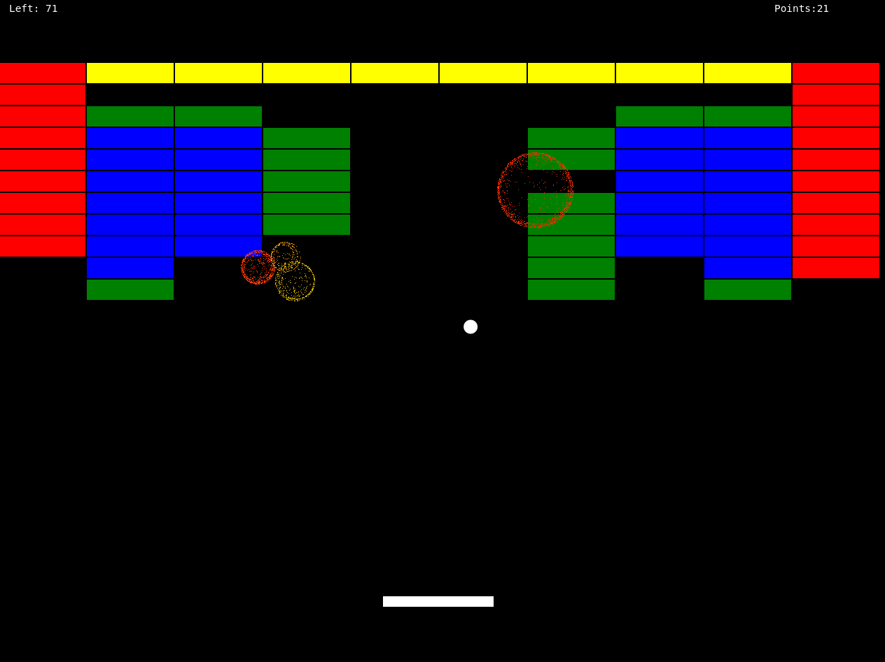

# Simple explosion js
This is a very primitive particle effect library without any external dependencies, which can be used to create a simple, radial, particle based explosion effect. You can see an example of the effect at the screenshot below (which is rendered on a canvas2d element). 


The only parameters you can specifiy for the explosion are:
* durationInFrames how many frames should the explosion last at all (it will create more particles at the beginning than in the end of its life-time)
* startParticleCount how many particles should be emitted at the beginning of the explosion?
* posX/posY What is the starting position of the explosion in screen coordinates (thus, starting with x/y = 0/0 at the top, left corner)

# Example usage with canvas2d
The following example shows, how to embed the explosion generator into a typicial game loop
```javascript
var canvasContext = ...; // Do whatever is necessary to create your canvas context
var explosions = [];
explosions.push(simpleExplosionGenerator.startExplosion(60, 100, 50, 300)); // Create an explosion lasting for 60 frames starting with 100 particles at 50/300
explosions.push(simpleExplosionGenerator.startExplosion(30, 50, 70, 250)); // Create another explosion lasting for 30 frames starting with 50 particles at 70/250

// your game loop
function gameLoop() {
    ...
    explosionsHandling(explosions);
    drawExplosions(explosions);

    function explosionsHandling(explosions) {
        var remainingExplosions = [];
        for (var i = 0; i < explosions.length; i++) {
            // Make sure to call this each and every frame, in order to update the model of the explosion
            if (simpleExplosionGenerator.updateNewFrame(explosions[i])) {
                remainingExplosions.push(explosions[i]);
            }
        }
        explosions = remainingExplosions;
    }

    function drawExplosions(explosions) {
        for (var i = 0; i < explosions.length; i++) {
            var explosion = explosions[i];
            var color = 'rgba(FF0000AA)'; // We use red here as a color with some transparency effect, but of course you can also alternate the colors if you want to
            canvasContext.fillStyle = color;
            for (var j = 0; j < explosion.particles.length; j++) {
                var particle = explosion.particles[j];
                canvasContext.fillRect(Math.floor(topLeftX), Math.floor(topLeftY), 1, 1; // Draw the particle as a 1/1 rectangle
            }
        }
    }
}
```

# Why should I use this library at all?
If you need some fancy state-of-the-art particle effects with a lot of highly configurable parameters, this is definitely **not** the right library for you. It is as simple as possible and has really just one purpose: to create a simplistic model for a radial emmitting particle effect, probably used at development-time to see at least some effects (before replacing it with some more advanced-but-complicated other solution). 
